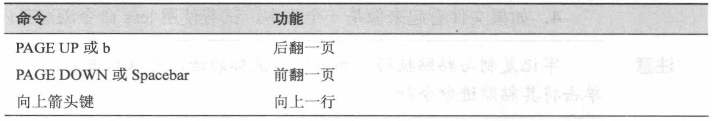
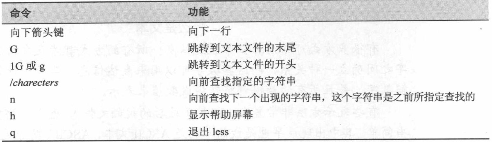

# Chap 1-3 Navigation

### Several Common Commandline

* **date** : show the date and time of the system

* **cal** : show the calendar of the system

* **df** : check the (disk free) space

* **free** : check the memory free space

* **pwd** : print working directory like /usr/home

* **cd** : change directory

* **ls** : list the content of the directory

* **file** : check category of the file

* **less** : check content of the file

* **uname** : check linux version


### Examples of Commandlines

* **date** :

```
jiazhen@jiazhen-VirtualBox:~$ date
Thu Feb  2 13:56:29 EST 2017
```
* **cal** : 

```
jiazhen@jiazhen-VirtualBox:~$ cal
   February 2017      
Su Mo Tu We Th Fr Sa  
          1  2  3  4  
 5  6  7  8  9 10 11  
12 13 14 15 16 17 18  
19 20 21 22 23 24 25  
26 27 28 
```

* **df** : 

```
jiazhen@jiazhen-VirtualBox:~$ df
Filesystem     1K-blocks    Used Available Use% Mounted on
udev             2003780       0   2003780   0% /dev
tmpfs             404656    6220    398436   2% /run
/dev/sda1       37024320 4416460  30704092  13% /
tmpfs            2023268     216   2023052   1% /dev/shm
tmpfs               5120       4      5116   1% /run/lock
tmpfs            2023268       0   2023268   0% /sys/fs/cgroup
tmpfs             404656      48    404608   1% /run/user/1000
/dev/sr0           57064   57064         0 100% /media/jiazhen/VBOXADDITIONS_5.0.32_112930
```

* **free** : 

```
jiazhen@jiazhen-VirtualBox:~$ free
              total        used        free      shared  buff/cache   available
Mem:        4046540      619208     2425444       13992     1001888     3149220
Swap:       4192252           0     4192252
```

* **pwd** : 

```
jiazhen@jiazhen-VirtualBox:~$ pwd
/home/jiazhen
```

* **cd** : 

```
jiazhen@jiazhen-VirtualBox:~$ cd Downloads/
jiazhen@jiazhen-VirtualBox:~/Downloads$ pwd
/home/jiazhen/Downloads
jiazhen@jiazhen-VirtualBox:~/Downloads$ cd ../
jiazhen@jiazhen-VirtualBox:~$ pwd
/home/jiazhen
```


* **ls -a** : list all the content of the directory, including hiding contents

```
jiazhen@jiazhen-VirtualBox:~$ ls -a
.              examples.desktop           Templates
..             .gconf                     user_space_report.txt
.bash_history  .gnupg                     .vboxclient-clipboard.pid
.bash_logout   .ICEauthority              .vboxclient-display.pid
.bashrc        .lesshst                   .vboxclient-draganddrop.pid
.cache         .local                     .vboxclient-seamless.pid
.config        .mozilla                   Videos
.dbus          Music                      .Xauthority
Desktop        Pictures                   .xinputrc
.dmrc          .profile                   .xsession-errors
Documents      Public                     .xsession-errors.old
Downloads      .sudo_as_admin_successful
```

* **ls -l** : list the content of the directory with long format

```
jiazhen@jiazhen-VirtualBox:~$ ls -l
total 48
drwxr-xr-x 2 jiazhen jiazhen 4096 Jan 31 16:16 Desktop
drwxr-xr-x 2 jiazhen jiazhen 4096 Oct 15 23:03 Documents
drwxr-xr-x 2 jiazhen jiazhen 4096 Jan 31 21:03 Downloads
-rw-r--r-- 1 jiazhen jiazhen 8980 Oct 15 22:41 examples.desktop
drwxr-xr-x 2 jiazhen jiazhen 4096 Oct 15 23:03 Music
drwxr-xr-x 2 jiazhen jiazhen 4096 Oct 15 23:03 Pictures
drwxr-xr-x 2 jiazhen jiazhen 4096 Oct 15 23:03 Public
drwxr-xr-x 2 jiazhen jiazhen 4096 Oct 15 23:03 Templates
-rw-rw-r-- 1 jiazhen jiazhen  103 Oct 25 18:13 user_space_report.txt
drwxr-xr-x 2 jiazhen jiazhen 4096 Oct 15 23:03 Videos
```

* **ls -lthr** : combine serveral options, below is one option with **long format**, **human readable**, **time** and **reverse**

```
jiazhen@jiazhen-VirtualBox:~$ ls -lhtr
total 48K
-rw-r--r-- 1 jiazhen jiazhen 8.8K Oct 15 22:41 examples.desktop
drwxr-xr-x 2 jiazhen jiazhen 4.0K Oct 15 23:03 Templates
drwxr-xr-x 2 jiazhen jiazhen 4.0K Oct 15 23:03 Public
drwxr-xr-x 2 jiazhen jiazhen 4.0K Oct 15 23:03 Documents
drwxr-xr-x 2 jiazhen jiazhen 4.0K Oct 15 23:03 Videos
drwxr-xr-x 2 jiazhen jiazhen 4.0K Oct 15 23:03 Pictures
drwxr-xr-x 2 jiazhen jiazhen 4.0K Oct 15 23:03 Music
-rw-rw-r-- 1 jiazhen jiazhen  103 Oct 25 18:13 user_space_report.txt
drwxr-xr-x 2 jiazhen jiazhen 4.0K Jan 31 16:16 Desktop
drwxr-xr-x 2 jiazhen jiazhen 4.0K Jan 31 21:03 Downloads
```

* **ls -lFS** : combine serveral options, below is one option with **long format**, **classify** and list with file **Size**

```
jiazhen@jiazhen-VirtualBox:~$ ls -lFS
total 48
-rw-r--r-- 1 jiazhen jiazhen 8980 Oct 15 22:41 examples.desktop
drwxr-xr-x 2 jiazhen jiazhen 4096 Jan 31 16:16 Desktop/
drwxr-xr-x 2 jiazhen jiazhen 4096 Oct 15 23:03 Documents/
drwxr-xr-x 2 jiazhen jiazhen 4096 Jan 31 21:03 Downloads/
drwxr-xr-x 2 jiazhen jiazhen 4096 Oct 15 23:03 Music/
drwxr-xr-x 2 jiazhen jiazhen 4096 Oct 15 23:03 Pictures/
drwxr-xr-x 2 jiazhen jiazhen 4096 Oct 15 23:03 Public/
drwxr-xr-x 2 jiazhen jiazhen 4096 Oct 15 23:03 Templates/
drwxr-xr-x 2 jiazhen jiazhen 4096 Oct 15 23:03 Videos/
-rw-rw-r-- 1 jiazhen jiazhen  103 Oct 25 18:13 user_space_report.txt
```

* **file** :

```
jiazhen@jiazhen-VirtualBox:~$ file Downloads/
Downloads/: directory
jiazhen@jiazhen-VirtualBox:~$ file user_space_report.txt 
user_space_report.txt: ASCII text
jiazhen@jiazhen-VirtualBox:~$ 
```

* **less** : 

```
12      examples.desktop
4       Videos
4       Templates
4       Public
4       Pictures
4       Music
4       Downloads
4       Documents
4       Desktop
(END)
```



* **uname** :

```
jiazhen@jiazhen-VirtualBox:~$ uname
Linux
jiazhen@jiazhen-VirtualBox:~$ uname -a
Linux jiazhen-VirtualBox 4.4.0-59-generic #80-Ubuntu SMP Fri Jan 6 17:47:47 UTC 2017 x86_64 x86_64 x86_64 GNU/Linux
jiazhen@jiazhen-VirtualBox:~$ uname -r
4.4.0-59-generic
```