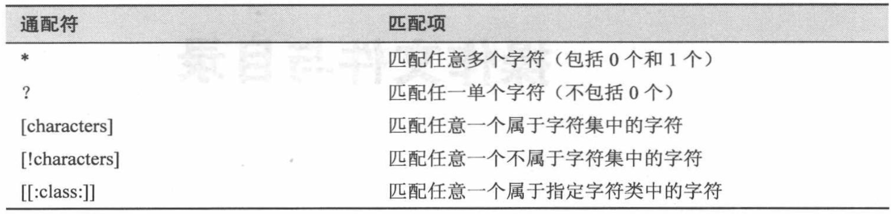
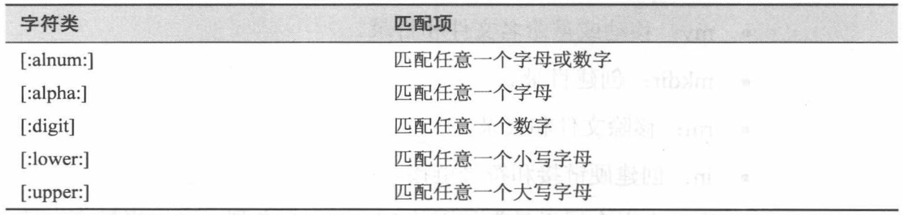
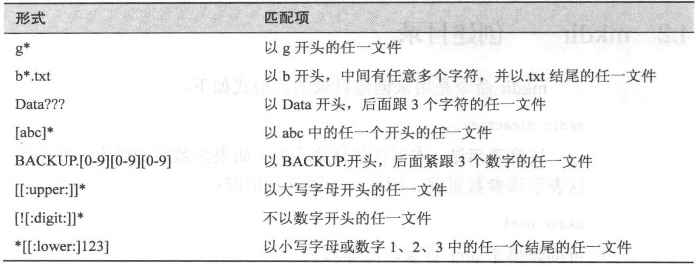
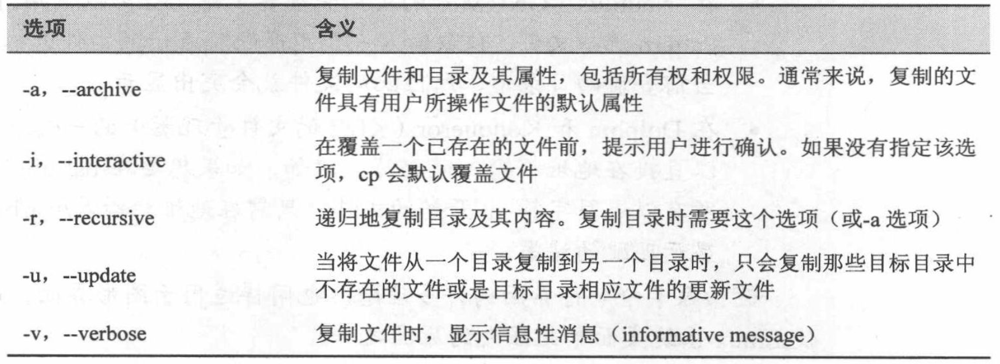
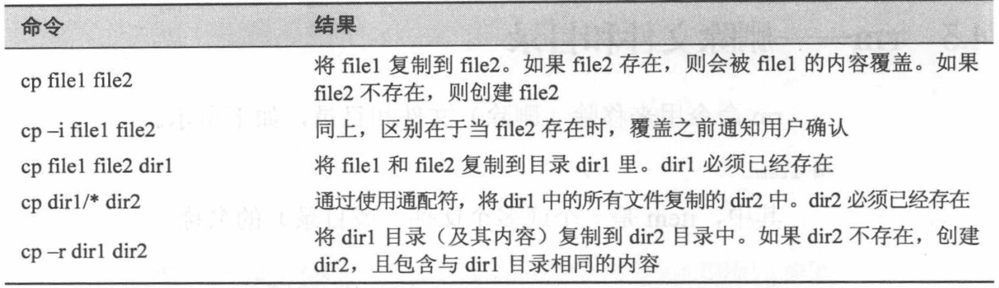
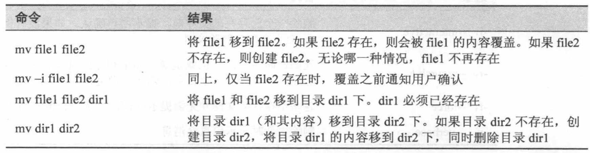
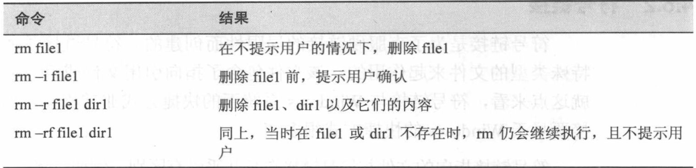

# Chap 4 File and Dir Operation

### Several Common Commandline

* **cp** : copy file or directory

* **mv** : move file or directory

* **mkdir** : create directory

* **rm** : remove file or directory

* **ln** : create ln link or signal link

   * ln file link => create a hard link (only file)
   
   * ln -s item link => create a signal link wich can be a file or directory


### Wildcards








### Examples of Commandlines

* **cp** : One example to copy all the HTML files from one directory to another, but only copy files that do not exist in the destination directory or are newer than the versions in the destination directory

```
cp -u *.html destination
```

  




**PS:** cd is to get to the working directory and '.' means the current working directory. The cmd copies the passwd file from /etc to the current working directory. '-v' shows the detailed information of the operation. 

```
jiazhen@jiazhen-VirtualBox:~/playground$ cd
jiazhen@jiazhen-VirtualBox:~$ cp /etc/passwd .
jiazhen@jiazhen-VirtualBox:~$ ls
Desktop    examples.desktop  Pictures    Templates
Documents  Music             playground  user_space_report.txt
Downloads  passwd            Public      Videos
```

```
jiazhen@jiazhen-VirtualBox:~$ cp -v /etc/passwd .
'/etc/passwd' -> './passwd'
```

* **mv** : move file or directory



**PS:** **mv** function copies all the information from passwd and moves to fun and deletes the previous file. It looks like **passwd** renames to **fun**.

```
jiazhen@jiazhen-VirtualBox:~$ mv passwd fun
jiazhen@jiazhen-VirtualBox:~$ ls
Desktop    examples.desktop  Pictures    Templates
Documents  fun               playground  user_space_report.txt
Downloads  Music             Public      Videos
```

```
jiazhen@jiazhen-VirtualBox:~/playground$ mv fun dir1
jiazhen@jiazhen-VirtualBox:~/playground$ ls
dir1  dir2
```

* **mkdir** :

```
jiazhen@jiazhen-VirtualBox:~$ mkdir playground
jiazhen@jiazhen-VirtualBox:~$ ls
Desktop    examples.desktop  playground  user_space_report.txt
Documents  Music             Public      Videos
Downloads  Pictures          Templates
jiazhen@jiazhen-VirtualBox:~$ cd playground/
jiazhen@jiazhen-VirtualBox:~/playground$ mkdir dir1 dir2 dir3
jiazhen@jiazhen-VirtualBox:~/playground$ ls
dir1  dir2  dir3
``` 

* **rm** : Whenever you use wildcards with rm (besides carefully checking your typing!), test the wildcard first with ls.



* **in** : 

**PS:** create ln hard link, there are four instances for fun. fun and fun-hard are the same file actually.

```
jiazhen@jiazhen-VirtualBox:~/playground$ ln fun fun-hard
jiazhen@jiazhen-VirtualBox:~/playground$ ln fun dir1/fun-hard
jiazhen@jiazhen-VirtualBox:~/playground$ ln fun dir2/fun-hard
jiazhen@jiazhen-VirtualBox:~/playground$ ls -l
total 16
drwxrwxr-x 2 jiazhen jiazhen 4096 Feb  3 18:00 dir1
drwxrwxr-x 2 jiazhen jiazhen 4096 Feb  3 18:00 dir2
-rw-r--r-- 4 jiazhen jiazhen 2291 Feb  3 17:58 fun
-rw-r--r-- 4 jiazhen jiazhen 2291 Feb  3 17:58 fun-hard
```
**PS:** *ls -li* is to check instance number of each link and file   

```
jiazhen@jiazhen-VirtualBox:~/playground$ ls -li
total 16
1315009 drwxrwxr-x 2 jiazhen jiazhen 4096 Feb  3 18:00 dir1
1577220 drwxrwxr-x 2 jiazhen jiazhen 4096 Feb  3 18:00 dir2
 954343 -rw-r--r-- 4 jiazhen jiazhen 2291 Feb  3 17:58 fun
 954343 -rw-r--r-- 4 jiazhen jiazhen 2291 Feb  3 17:58 fun-hard
```

**PS:** *ln -s* is to create a signal link which can show the  connection between the link file and original file

```
jiazhen@jiazhen-VirtualBox:~/playground$ ln -s fun fun-sym
jiazhen@jiazhen-VirtualBox:~/playground$ ln -s ../fun dir1/fun-sym
jiazhen@jiazhen-VirtualBox:~/playground$ ln -s ../fun dir2/fun-sym
jiazhen@jiazhen-VirtualBox:~/playground$ ls -li
total 16
1315009 drwxrwxr-x 2 jiazhen jiazhen 4096 Feb  3 20:00 dir1
1577220 drwxrwxr-x 2 jiazhen jiazhen 4096 Feb  3 20:00 dir2
 954343 -rw-r--r-- 4 jiazhen jiazhen 2291 Feb  3 17:58 fun
 954343 -rw-r--r-- 4 jiazhen jiazhen 2291 Feb  3 17:58 fun-hard
1316325 lrwxrwxrwx 1 jiazhen jiazhen    3 Feb  3 20:00 fun-sym -> fun
```
