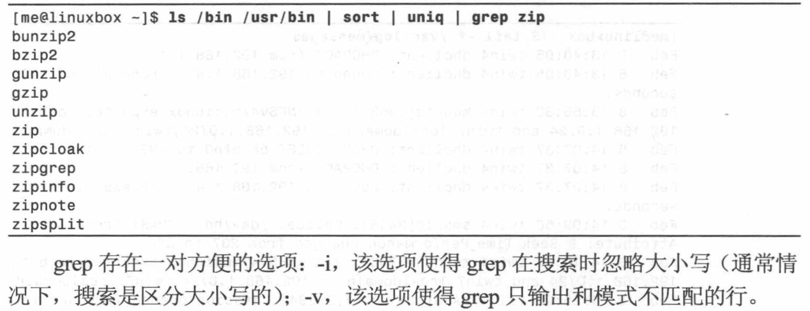
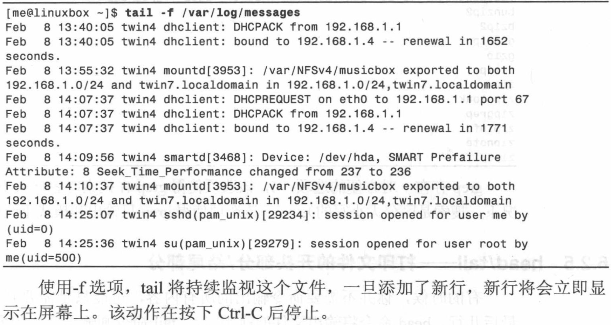

# Chap 6 Redirection

### Several Common Commandline

* **cat** : concatenate files

* **sort** : sort lines or texts

* **uniq** : report or delete duplicate lines of a file

* **wc** : print newline, word, and byte counts for each file

* **grep** : print lines matching a pattern

* **head** : output the first part of a file

* **tail** : output the last part of a file 

* **tee** : read from standard input and write to standard output and files 

### Examples of Commandlines

* **stout** : redirection of standard output

```
jiazhen@jiazhen-VirtualBox:~$ ls -l /usr/bin > ls-output.txt
jiazhen@jiazhen-VirtualBox:~$ less ls-output.txt 
jiazhen@jiazhen-VirtualBox:~$ ls -l ls-output.txt 
-rw-rw-r-- 1 jiazhen jiazhen 105105 Feb  3 22:58 ls-output.txt
```

* **>>** : it is to add contents from the bottom, not like > to cover the previous content

```
jiazhen@jiazhen-VirtualBox:~$ ls -l /usr/bin >> ls-output.txt 
jiazhen@jiazhen-VirtualBox:~$ ls -l ls-output.txt 
-rw-rw-r-- 1 jiazhen jiazhen 210210 Feb  3 23:00 ls-output.txt
```

* **2>** :stout only error message 
* **&>** :stout both correct and error message

```
jiazhen@jiazhen-VirtualBox:~$ ls -l /bin/usr 2> ls-output.txt
jiazhen@jiazhen-VirtualBox:~$ ls -l /bin/usr &> ls-output.txt 
```

* **cat** : Use Ctrl-d to EOF

```
jiazhen@jiazhen-VirtualBox:~/playground$ cat > aaa.txt
Hello World!
jiazhen@jiazhen-VirtualBox:~/playground$ cat aaa.txt
Hello World!
```

```
cat movie.mpeg.0* > movie.mpeg
```

* **sort** & **uniq** : 

   **PS** : uniq -d is to show the duplicate lines 

```
jiazhen@jiazhen-VirtualBox:~/playground$ ls -l /usr/bin | sort | uniq 
lrwxrwxrwx 1 root root         10 Dec 13 16:05 apport-collect -> apport-bug
lrwxrwxrwx 1 root root         10 Dec 13 16:05 ubuntu-bug -> apport-bug
lrwxrwxrwx 1 root root         10 Oct 15 22:39 chacl -> /bin/chacl
```

* **wc** : it displays the number of lines, words, and bytes
contained in files

```
jiazhen@jiazhen-VirtualBox:~$ wc user_space_report.txt 
  9  18 103 user_space_report.txt
jiazhen@jiazhen-VirtualBox:~$ wc -l user_space_report.txt 
9 user_space_report.txt
```

* **grep** :



* **head & tail** :

```
jiazhen@jiazhen-VirtualBox:~$ head -n 5 user_space_report.txt 
12	examples.desktop
4	Videos
4	Templates
4	Public
4	Pictures
jiazhen@jiazhen-VirtualBox:~$ tail -n 5 user_space_report.txt 
4	Pictures
4	Music
4	Downloads
4	Documents
4	Desktop
```


* **tee** : The tee program reads standard input and copies it to both standard output

```
jiazhen@jiazhen-VirtualBox:~$ ls /usr/bin | tee ls-out.txt | grep zip
funzip
gpg-zip
mzip
preunzip
prezip
prezip-bin
unzip
unzipsfx
zip
zipcloak
zipdetails
zipgrep
zipinfo
zipnote
zipsplit
```


