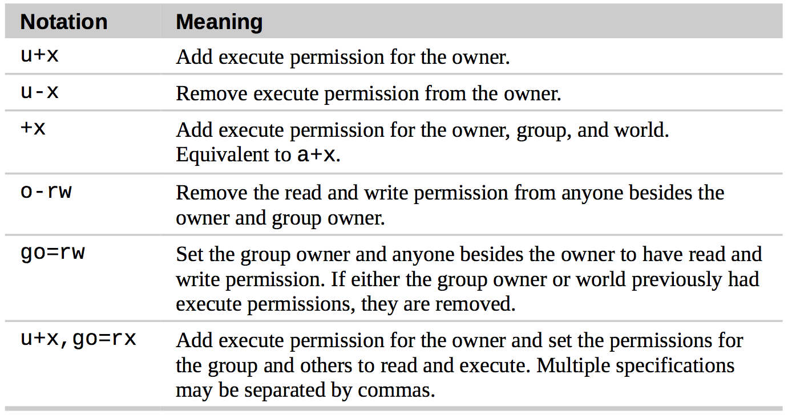

# Chap 9 Permissions

### Several Common Commandline

* **id** : Display user identity

* **chmod** : Change a file's mode

* **umask** : Set the default file permissions

* **su** : Run a shell as another user 
  * 'sudo su' cmd can be used to get root access to Linux 

* **sudo** : Execute a command as another user

* **chown** : Change a file's owner

* **chgrp** : Change a file's group ownership

* **passwd** : Change a user's password


### Examples of Commandlines

* **id** : 

```
jiazhen@jiazhen-VirtualBox:~$ id
uid=1000(jiazhen) gid=1000(jiazhen) groups=1000(jiazhen),4(adm),24(cdrom),27(sudo),30(dip),46(plugdev),113(lpadmin),128(sambashare)
```

* **chmod** :

**PS** : Though re- membering the octal to binary mapping may seem inconvenient, you will usually only have to use a few common ones: 7 (rwx), 6 (rw-), 5 (r-x), 4 (r--), and 0 (---). So when permission changes to 600, it only have (rw-), other permissions changes to (---)


```
jiazhen@jiazhen-VirtualBox:~$ ls -l user_space_report.txt 
-rw-rw-r-- 1 jiazhen jiazhen 103 Oct 25 18:13 user_space_report.txt
jiazhen@jiazhen-VirtualBox:~$ chmod 600 user_space_report.txt 
jiazhen@jiazhen-VirtualBox:~$ ls -l user_space_report.txt 
-rw------- 1 jiazhen jiazhen 103 Oct 25 18:13 user_space_report.txt
```




* **sudo** :

```
jiazhen@jiazhen-VirtualBox:~$ sudo apt-get update
[sudo] password for jiazhen: 
Hit:1 http://us.archive.ubuntu.com/ubuntu xenial InRelease
```

* **su** :

```
jiazhen@jiazhen-VirtualBox:~$ sudo su
[sudo] password for jiazhen: 
root@jiazhen-VirtualBox:/home/jiazhen# exit
exit
jiazhen@jiazhen-VirtualBox:~$ 
```


* **chown** :
  * bob => Changes the ownership of the file from its current owner to user bob.
  * bob:users => Changes the ownership of the file from its current owner to user bob and changes the file group owner to group users.
  * :admins => Changes the group owner to the group admins. The file owner is unchanged.
  * bob: => Change the file owner from the current owner to user bob and changes the group owner to the login group of user bob

```
[janet@linuxbox ~]$ sudo cp myfile.txt ~tony Password:
[janet@linuxbox ~]$ sudo ls -l ~tony/myfile.txt
-rw-r--r-- 1 root root 8031 2008-03-20 14:30 /home/tony/myfile.txt
[janet@linuxbox ~]$ sudo chown tony: ~tony/myfile.txt 
[janet@linuxbox ~]$ sudo ls -l ~tony/myfile.txt
 -rw-r--r-- 1 tony  tony  8031 2008-03-20 14:30 /home/tony/myfile.txt
```

* **passwd** : 

```
[me@linuxbox ~]$ passwd
(current) UNIX password:
New UNIX password:
BAD PASSWORD: is too similar to the old one New UNIX password:
BAD PASSWORD: it is WAY too short
```


