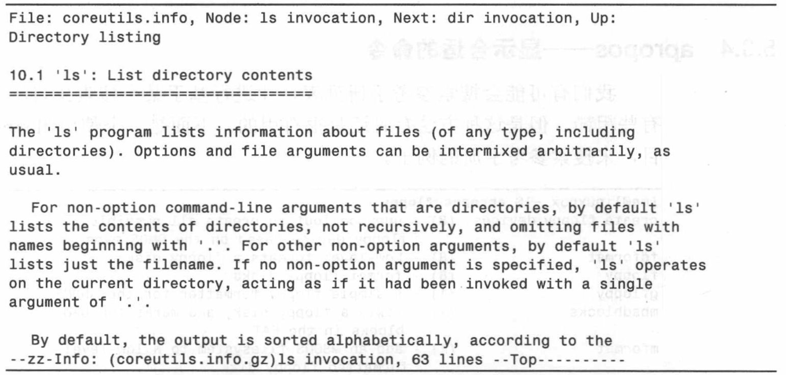

# Chap 5 Help Command

### Several Common Commandline

* **type** : show the explanation of the command

* **which** : show the location of ***executive*** command

* **man** : show manual of command (like less)

* **help** : to show the help information of command

* **info** : show info of command

* **whatis** : show the brief of a command

* **alias** : create a new command (disappear with the close of termianl)


### Examples of Commandlines

* **type** : 

```
jiazhen@jiazhen-VirtualBox:~$ type type
type is a shell builtin
jiazhen@jiazhen-VirtualBox:~$ type ls
ls is aliased to `ls --color=auto'
jiazhen@jiazhen-VirtualBox:~$ type cp
cp is hashed (/bin/cp)
```

* **which** : 

```
jiazhen@jiazhen-VirtualBox:~$ which ls
/bin/ls
jiazhen@jiazhen-VirtualBox:~$ which python
/usr/bin/python
```

* **help** :
  * If it is shell internal command, use help cmd like help cd
  * If it not, use cmd --help 


```
jiazhen@jiazhen-VirtualBox:~$ mkdir --help
Usage: mkdir [OPTION]... DIRECTORY...
Create the DIRECTORY(ies), if they do not already exist.

Mandatory arguments to long options are mandatory for short options too.
  -m, --mode=MODE   set file mode (as in chmod), not a=rwx - umask
  -p, --parents     no error if existing, make parent directories as needed
  -v, --verbose     print a message for each created directory
```

* **man** : 


* **info** : 



* **whatis** : 

```
jiazhen@jiazhen-VirtualBox:~$ whatis cp
cp (1)               - copy files and directories
```

* **alias** :

```
jiazhen@jiazhen-VirtualBox:~$ cd /usr; ls; cd -
bin  games  include  lib  local  locale  sbin  share  src
/home/jiazhen
jiazhen@jiazhen-VirtualBox:~$ alias foo='cd /usr; ls; cd -'
jiazhen@jiazhen-VirtualBox:~$ foo
bin  games  include  lib  local  locale  sbin  share  src
/home/jiazhen
```
**PS:** ***unalias*** can be used to delete previous alias

```
jiazhen@jiazhen-VirtualBox:~$ type foo
foo is aliased to `cd /usr; ls; cd -'
jiazhen@jiazhen-VirtualBox:~$ unalias foo
jiazhen@jiazhen-VirtualBox:~$ type foo
bash: type: foo: not found

```