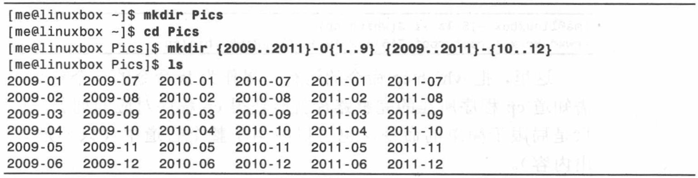
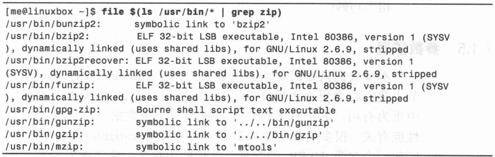
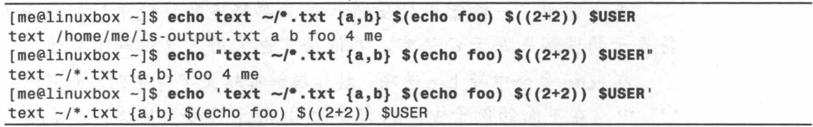
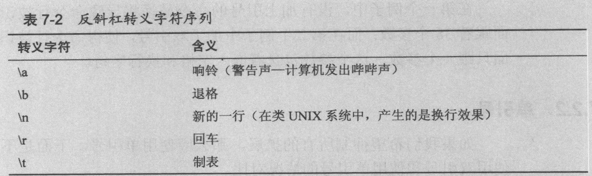
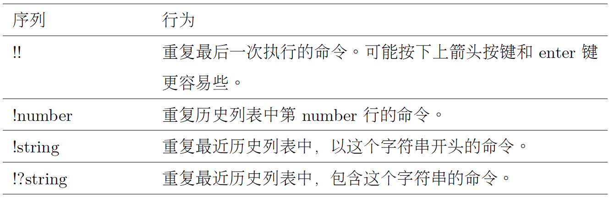

# Chap 7-8 See the World through Shell

### Several Common Commandline

* **echo** : display a line of text

* **clear**: clean the screen

* **history**: display the contents of the history list


### Examples of Commandlines

* **echo** : 

```
jiazhen@jiazhen-VirtualBox:~$ echo [[:upper:]]*
Desktop Documents Downloads Music Pictures Public Templates Videos
jiazhen@jiazhen-VirtualBox:~$ echo D*
Desktop Documents Downloads
jiazhen@jiazhen-VirtualBox:~$ echo /usr/*/share
/usr/local/share
```

**PS** : It expands into the name of the home directory of the named user

```
jiazhen@jiazhen-VirtualBox:~$ echo ~
/home/jiazhen
```

* Arithmetic Expansion:

```
jiazhen@jiazhen-VirtualBox:~$ echo $((2+2))
4
jiazhen@jiazhen-VirtualBox:~$ echo $(((5**2)*3))
75
```

* Brace Expansion:

```
jiazhen@jiazhen-VirtualBox:~$ echo Front-{A,B,C}-Back
Front-A-Back Front-B-Back Front-C-Back
jiazhen@jiazhen-VirtualBox:~$ echo Number-{1..5}
Number-1 Number-2 Number-3 Number-4 Number-5
jiazhen@jiazhen-VirtualBox:~$ echo a{A{1,2},B{3,4}}b
aA1b aA2b aB3b aB4b
```

* Create folders with Date/Time



* Echo Current User

```
jiazhen@jiazhen-VirtualBox:~$ echo $USER
jiazhen
jiazhen@jiazhen-VirtualBox:~$ ls -l $(which cp)
-rwxr-xr-x 1 root root 151024 Feb 18  2016 /bin/cp
```

* Echo usage on pipeline



* Echo with restriction of single quotes and double quotes



* Escaping Characters: Adding the ‘-e’ option to echo will enable interpretation of escape sequences. 

```
jiazhen@jiazhen-VirtualBox:~$ echo "The balance for user $USER is: \$5.00"
The balance for user jiazhen is: $5.00
```



* echo 命令带上‘-e’ 选项，能够解释转义序列

```
sleep 10; echo -e ”Time’s up\a”
sleep 10; echo ”Time’s up” $’\a’
```


### Cursor Movement

* Ctrl-a: Move cursor to the beginning of the line. 
* Ctrl-e: Move cursor to the end of the line.
* Alt-f: Move cursor forward one word.
* Alt-b: Move cursor backward one word.
* Alt-L: Convert the characters from the cursor location to the end of the word to lowercase.
* Alt-U: Convert the characters from the cursor location to the end of the word to uppercase.
* Ctrl-k: Kill text from the cursor location to the end of line.
* Ctrl-u: Kill text from the cursor location to the beginning of line.
* Alt-d: Kill text from the cursor location to the end of the current word.
* Alt-ackspace: Kill text from the cursor location to the beginning of the current word. If the cursor is at the beginning of a word, kill the previous word.
* Ctrl-y: Yank text from the kill-ring and insert it at the cursor location.    

### Usage of 'history'

* Use !number to use the cmnd we found.

```
jiazhen@jiazhen-VirtualBox:~$ history | head
    1  sudo apt-get update
    2  sudo apt-get install git
    3  sudo apt-get install gdb
    4  du -s * | sort -nr > $HOME/user_space_report.txt
    5  ls
    6  less user_space_report.txt 
    7  file user_space_report.txt 
    8  ifconfig
    9  ping 10.0.2.15
   10  ls
jiazhen@jiazhen-VirtualBox:~$ !10
ls
``` 

```
jiazhen@jiazhen-VirtualBox:~$ history | grep /usr/bin
  361  ls -l /usr/bin | less
  362  ls /bin /usr/bin | sort | less
  365  ls -l /usr/bin > ls-output.txt
  368  ls -l /usr/bin > ls-output.txt
  371  ls -l /usr/bin >> ls-output.txt 
  390  ls -l /usr/bin | sort | uniq
  391  ls -l /usr/bin | sort | uniq | less
  392  ls -l /usr/bin | sort | uniq
  393  ls -l /usr/bin | sort | uniq -d
  394* ls -l /usr/bin | sort | u
  395  ls -l /usr/bin | sort | uniq 
  405  ls /usr/bin | tee ls-out.txt | grep zip
  456  history | grep /usr/bin
  457  $ history | grep /usr/bin
  458  history | grep /usr/bin
  460  ls -l /usr/bin | sort | uniq 
  463  history | grep /usr/bin
```

