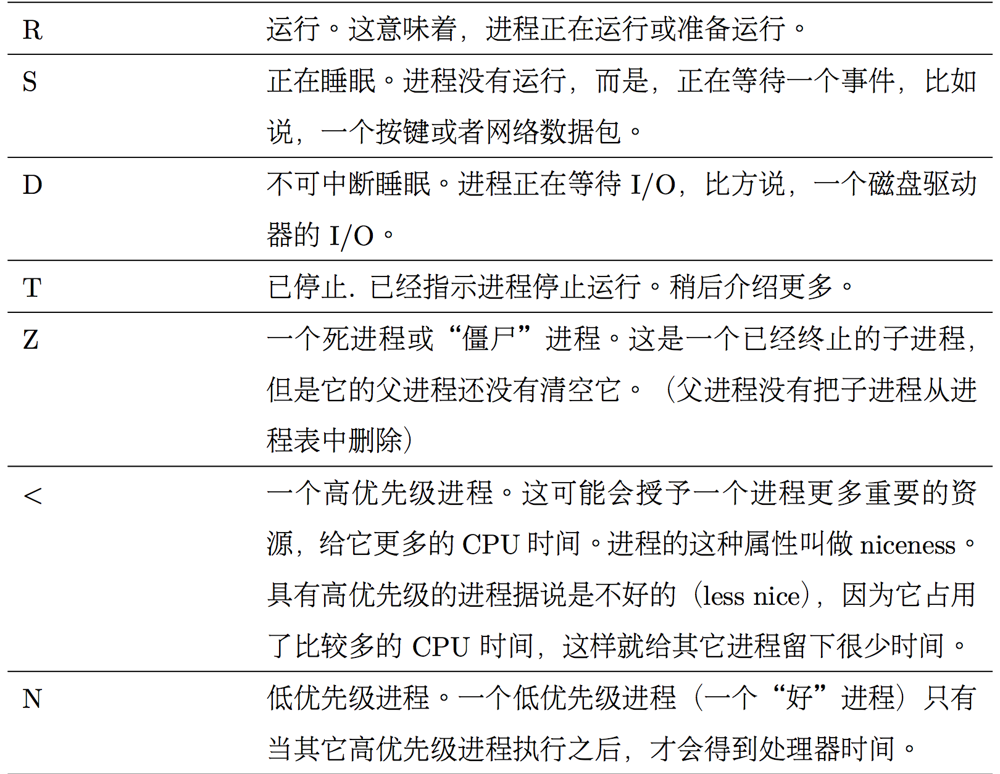
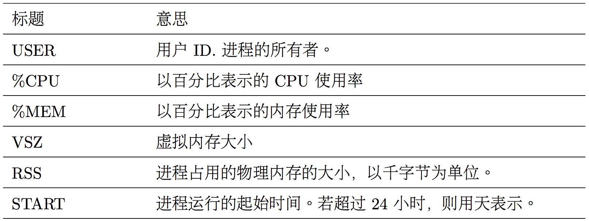
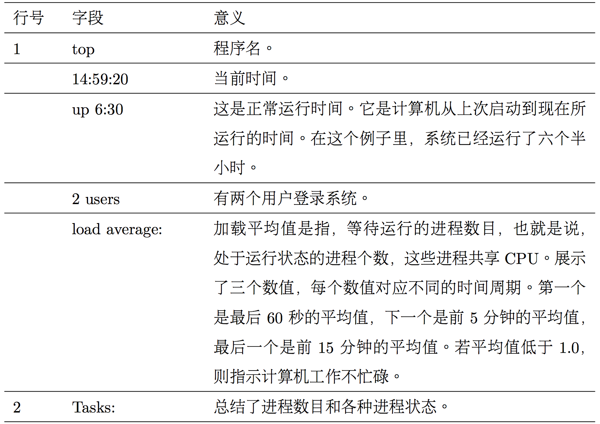
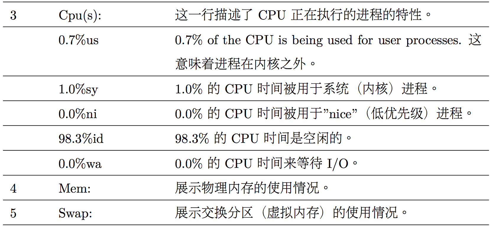
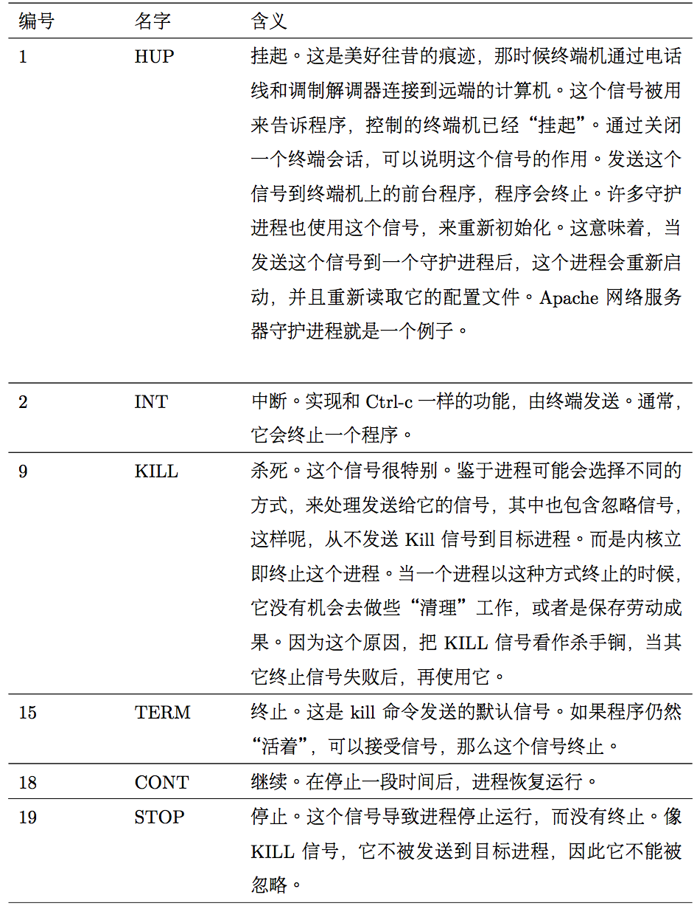

# Chap 10 Processes

### Several Common Commandline

* **ps** : Report a snapshot of current processes

* **jobs** : List active jobs

* **bg** : Place a job in the background

* **fg** : Place a job in the foreground

* **kill** : Send a signal to a process

* **killall** : Kill processes by name

* **pkill** : Kill a process by name

* **shutdown** : Shutdown or reboot the system


### Examples of Commandlines

* **ps** : 

**PS** : TTY is short for “Teletype,”and refers to the controlling terminal for the process. ps x is to show all of our processes regardless of what terminal (if any) they are controlled by.

```
jiazhen@jiazhen-VirtualBox:~$ ps
  PID TTY          TIME CMD
26121 pts/4    00:00:00 bash
27399 pts/4    00:00:00 ps
jiazhen@jiazhen-VirtualBox:~$ ps x
  PID TTY      STAT   TIME COMMAND
 1245 ?        Ss     0:00 /lib/systemd/systemd --user
 1249 ?        S      0:00 (sd-pam)
jiazhen@jiazhen-VirtualBox:~$ ps aux | head -n 5
USER       PID %CPU %MEM    VSZ   RSS TTY      STAT START   TIME COMMAND
root         1  0.0  0.1 119876  5992 ?        Ss   Feb05   0:01 /sbin/init splash
root         2  0.0  0.0      0     0 ?        S    Feb05   0:00 [kthreadd]
root         3  0.0  0.0      0     0 ?        S    Feb05   0:00 [ksoftirqd/0]
root         5  0.0  0.0      0     0 ?        S<   Feb05   0:00 [kworker/0:0H]
```





* **top** : 

```
jiazhen@jiazhen-VirtualBox:~$ top

top - 15:43:29 up 20:32,  1 user,  load average: 0.08, 0.09, 0.04
Tasks: 197 total,   1 running, 196 sleeping,   0 stopped,   0 zombie
%Cpu(s):  9.4 us,  1.0 sy,  0.0 ni, 89.4 id,  0.0 wa,  0.0 hi,  0.2 si,  0.0 st
KiB Mem :  4046540 total,  1934260 free,   708312 used,  1403968 buff/cache
KiB Swap:  4192252 total,  4192252 free,        0 used.  3041380 avail Mem 
```





* **jobs** : xlogo & is to put xlogo program to background

```
jiazhen@jiazhen-VirtualBox:~$ xlogo &
[1] 28038
jiazhen@jiazhen-VirtualBox:~$ jobs
[1]+  Running                 xlogo &
jiazhen@jiazhen-VirtualBox:~$ ps
  PID TTY          TIME CMD
28007 pts/4    00:00:00 bash
28038 pts/4    00:00:00 xlogo
28042 pts/4    00:00:00 ps
```

* **fg** :

```
jiazhen@jiazhen-VirtualBox:~$ xlogo &
[1] 28054
jiazhen@jiazhen-VirtualBox:~$ jobs
[1]+  Running                 xlogo &
jiazhen@jiazhen-VirtualBox:~$ fg %1
```

* Ctrl-Z is to stop the process, not terminate it. 

```
jiazhen@jiazhen-VirtualBox:~$ fg %1
xlogo
^Z
[1]+  Stopped                 xlogo
```

* **kill** : kill is just to send signal

```
jiazhen@jiazhen-VirtualBox:~$ xlogo &
[1] 28067
jiazhen@jiazhen-VirtualBox:~$ kill %1
```




* **killall** : 

```
jiazhen@jiazhen-VirtualBox:~$ xlogo &
[1] 28085
jiazhen@jiazhen-VirtualBox:~$ xlogo &
[2] 28087
jiazhen@jiazhen-VirtualBox:~$ killall xlogo
[1]-  Terminated              xlogo
```

