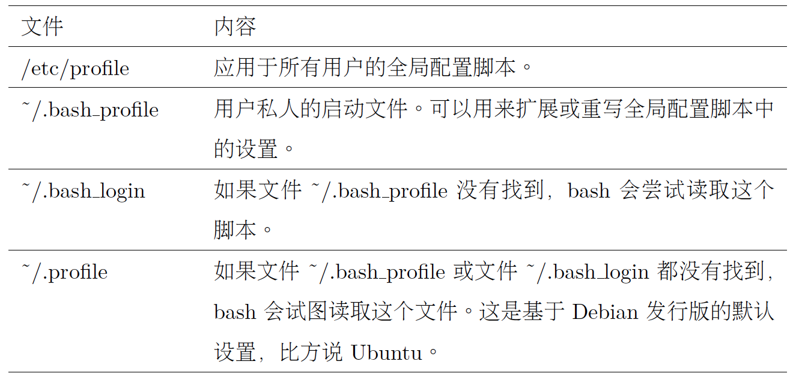
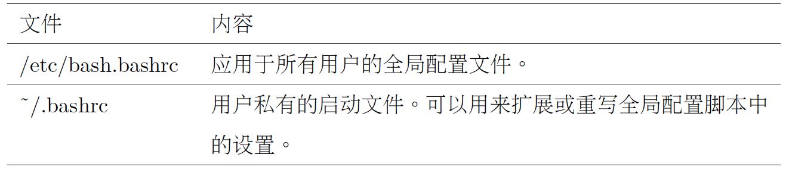

# Chap 11 Shell Environment

### Several Common Commandline

* **printenv** : Print part or all of the environment

* **set** : Set shell options

* **expport** : Export environment to subsequently executed programs

* **alias** : Create an alias for a command


### Examples of Commandlines

* **printenv** : 


```
jiazhen@ubuntu:~$ printenv
XDG_VTNR=7
XDG_SESSION_ID=c2
CLUTTER_IM_MODULE=xim
XDG_GREETER_DATA_DIR=/var/lib/lightdm-data/jiazhen
SESSION=ubuntu
GPG_AGENT_INFO=/home/jiazhen/.gnupg/S.gpg-agent:0:1
SHELL=/bin/bash
```

* **Startup Files For Login Shell Sessions**
* The ~/.bashrc file is probably the most important startup file from the ordinary user’s
point of view, since it is almost always read.





* **Method to Change ENV in Login Shell in Ubuntu**

```
jiazhen@ubuntu:~$ vim ~/.bashrc
```

* **Add lines at the bottom of the file**

```
fi

alias l.='ls -d .* --color=auto
```
* **Make our change Effective**

```
jiazhen@ubuntu:~$ source .bashrc
jiazhen@ubuntu:~$ l.
.              .cache   .ICEauthority              .Xauthority
..             .config  .local                     .xsession-errors
.bash_history  .dmrc    .profile                   .xsession-errors.old
.bash_logout   .gconf   .sudo_as_admin_successful
.bashrc        .gnupg   .viminfo
```