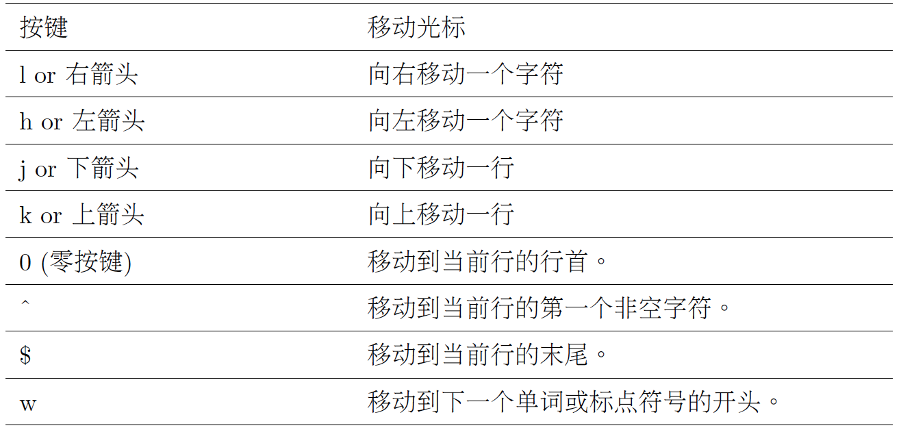
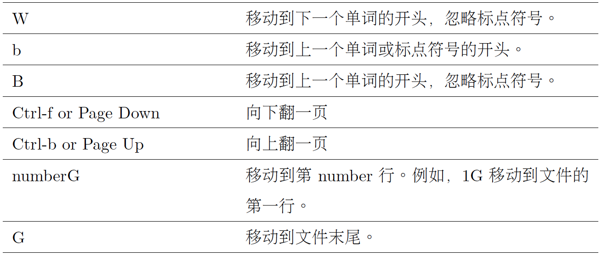
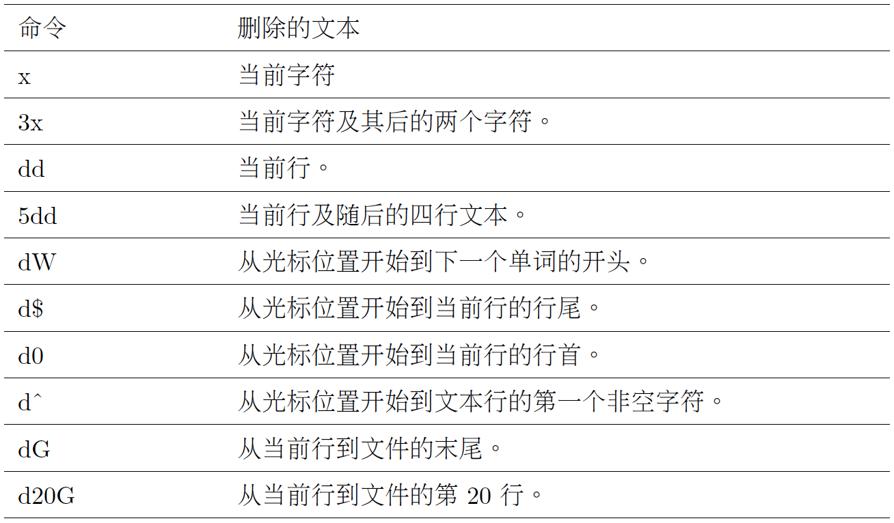
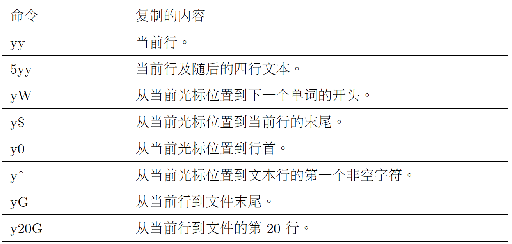
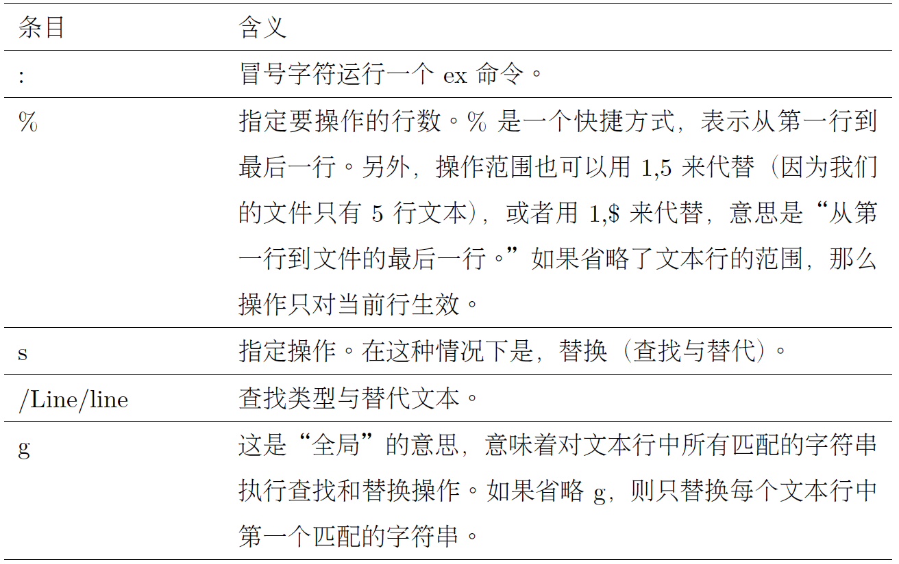

# Chap 12 VIM

### Several Common Commandline

* **:q** : To exit vim

* **:q!** : To exit vim withou save

* **:w** : Save the file

* **:wq** : Save and exit

* **Click 'ZZ'** : Save and exit

* **Click 'i'** : Enter insert mode

* **Click 'A'** : Add new lines

* **Click 'o'** : Insert a blank line below the current line

* **Click 'O'** : Insert a blank line above the current line

* **Click 'u'** : Undo

* **Click 'p'** : Paste line

* **Click 'J'** : Join one line with the other


### Examples of Commandlines

* **Cursor Movement Keys** : 






* **Delete Text** : 



* **Copy Text** : 




* **Searching The Entire File** : Use "/" then type the word or phrase, a search may be repeated using the previous search string with the n command.


* **Global Search And Replace** : 

```
:%s/Line/line/g
```



* **Below command is used for specifying a substitution command with user confirmation**

```
:%s/line/Line/gc
```


* **Editing Multiple Files** : ":n" command is used to switch one file to the next file. ":N" is used to switch back to previous file.

```
vim file1 file2 file3...
```

* **buffer function can be used to choose file we want**

```
:buffers
1 # "foo.txt" line 1
2 %a "ls-output.txt" line 0
Press ENTER or type command to continue
:buffer 1
```
