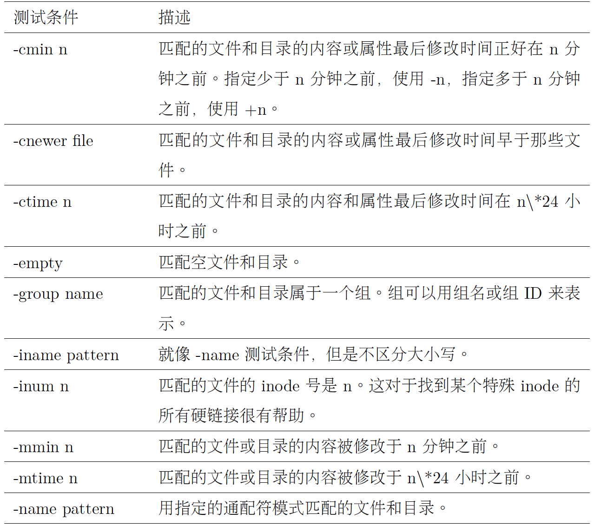
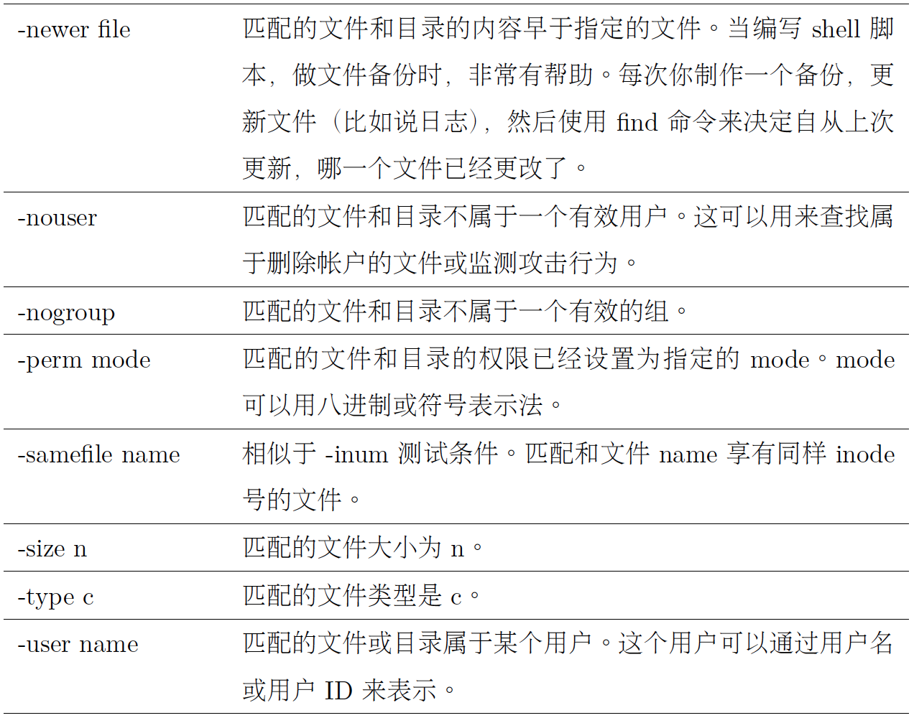
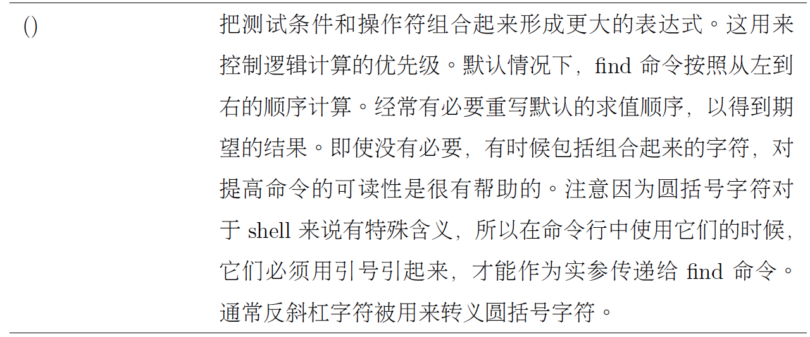
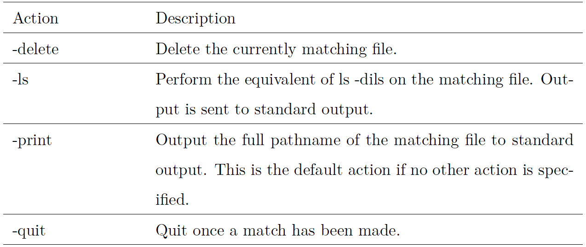

# Chap 17 Search File 

### Several Common Commandline

* **locate** : Find files by name

* **find** : Search for files in a directory hierarchy

* **xargs** : Build and execute command lines from standard input

* **touch** : Create new file or change file time

* **stat** : Display file or file system status


### Examples of Commandlines

* **locate** : performs a rapid database search

```
jiazhen@ubuntu:~/Downloads$ locate bin/zip
/usr/bin/zip
/usr/bin/zipcloak
/usr/bin/zipdetails
/usr/bin/zipgrep
/usr/bin/zipinfo
/usr/bin/zipnote
/usr/bin/zipsplit
```

```
jiazhen@ubuntu:~/Downloads$ locate bin | grep zip
/bin/bunzip2
/bin/bzip2
/bin/bzip2recover
/bin/gunzip
/bin/gzip
/lib/firmware/qed/qed_init_values_zipped-8.10.10.0.bin
/lib/firmware/qed/qed_init_values_zipped-8.10.5.0.bin
/lib/firmware/qed/qed_init_values_zipped-8.15.3.0.bin
/lib/firmware/qed/qed_init_values_zipped-8.20.0.0.bin
/lib/firmware/qed/qed_init_values_zipped-8.4.2.0.bin
/lib/firmware/qed/qed_init_values_zipped-8.7.3.0.bin
/usr/bin/funzip
```


* **find** : performs complicated method to search files

  **-type d** : search directory
  
  **-type f** : search file
  
  **-size +1k** : search file size over 1K

```
jiazhen@ubuntu:~/Downloads$ find ~ -type d | wc -l
184
jiazhen@ubuntu:~/Downloads$ find ~ -type f | wc -l
2739
```

```
jiazhen@ubuntu:~$ find ~ -type f -name "*.php" -size +1k
/home/jiazhen/index.php
```






* **Operation Signal** : find provides a way to combine tests using logical operators to create more complex
logical relationships.

```
find ~ \( -type f -not -perm 0600 \) -or \( -type d -not -perm 0700 \)
```

```
find ~ -type f -name 'foo*' -exec ls -l '{}' ';'
find ~ -type f -name 'foo*' -exec ls -l '{}' '+'
```



```
find ~ -type f -name '*.BAK' -delete
```



* **xargs** : It accepts input from standard input
and converts it into an argument list for a specified command

```
jiazhen@ubuntu:~$ find ~ -type f -name '*.php' -print | xargs ls -l
-rw-rw-r-- 1 jiazhen jiazhen 4153 Nov  4 22:56 /home/jiazhen/index.php
```

