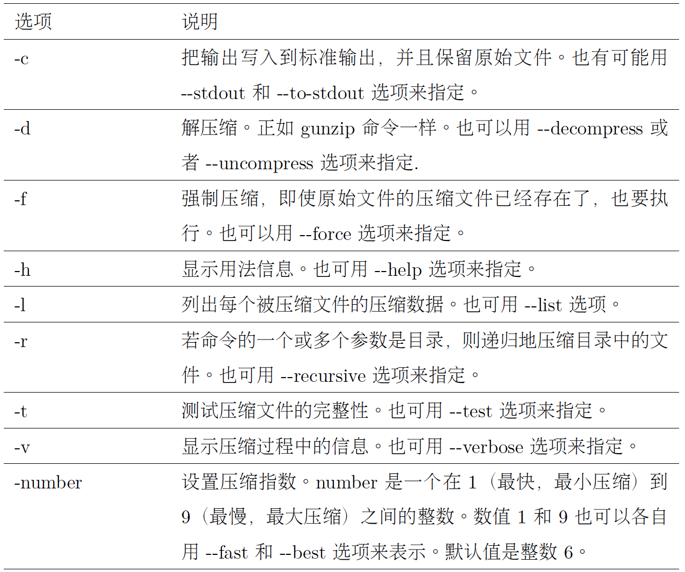

# Chap 18 Archive and Backup 

### Several Common Commandline

* **gzip** : Compress or expand files

* **bzip2** : A block sorting file compressor

* **tar** : Tape archiving utility

* **zip** : Package and compress files

* **rsync** : Remote file and directory synchronization


### Examples of Commandlines

* **gzip** : When executed, it replaces the
original file with a compressed version of the original. Use **gunzip** to expand the file.

* **zless** : can be used to preview content of zip file

```
jiazhen@ubuntu:~$ ls
Desktop    Downloads         index.php  Pictures  Templates
Documents  examples.desktop  Music      Public    Videos
jiazhen@ubuntu:~$ ls -l index*
-rw-rw-r-- 1 jiazhen jiazhen 4153 Nov  4 22:56 index.php
jiazhen@ubuntu:~$ gzip index.php
jiazhen@ubuntu:~$ ls
Desktop    Downloads         index.php.gz  Pictures  Templates
Documents  examples.desktop  Music         Public    Videos
jiazhen@ubuntu:~$ ls -l index*
-rw-rw-r-- 1 jiazhen jiazhen 1829 Nov  4 22:56 index.php.gz
```

* **bzip2** : When executed, it replaces the
original file with a compressed version of the original. Similar method with gzip  

```
jiazhen@ubuntu:~$ bzip2 index.php 
jiazhen@ubuntu:~$ ls
Desktop    Downloads         index.php.bz2  Pictures  Templates
Documents  examples.desktop  Music          Public    Videos
```



* **tar** : A tar archive can consist of a group of separate files, one or more directory hierarchies, or a mixture of both

```
tar -cf archive.tar foo bar  # Create archive.tar from files foo and bar.
tar -tvf archive.tar         # List all files in archive.tar verbosely.
tar -xf archive.tar          # Extract all files from archive.tar.
```

```
jiazhen@ubuntu:~/Downloads$ tar cf playground.tar playground/
jiazhen@ubuntu:~/Downloads$ ls
playground  playground.tar
jiazhen@ubuntu:~/Downloads$ tar tf playground.tar
playground/
playground/dir-063/
playground/dir-063/file-T
playground/dir-063/file-B
```

**PS** : tar only works for relative path 

```
jiazhen@ubuntu:~/Downloads$ mkdir foo
jiazhen@ubuntu:~/Downloads$ cd foo
jiazhen@ubuntu:~/Downloads/foo$ ls
jiazhen@ubuntu:~/Downloads/foo$ tar xf ../playground.tar 
jiazhen@ubuntu:~/Downloads/foo$ ls
playground
```


**PS** : tar is often used in conjunction with find to produce archives. In this example, we will use
find to produce a set of files to include in an archive

```
[me@linuxbox ~]$ find playground -name 'file-A' -exec tar rf playground.tar '{}' '+'
```

* **zip** : zip options zipfile file...

```
jiazhen@ubuntu:~/Downloads$ ls
playground  playground.tar
jiazhen@ubuntu:~/Downloads$ zip -r playground.zip playground
  adding: playground/ (stored 0%)
  adding: playground/dir-063/ (stored 0%)
  adding: playground/dir-063/file-T (stored 0%)
  adding: playground/dir-063/file-B (stored 0%)
  adding: playground/dir-063/file-Q (stored 0%)
  adding: playground/dir-063/file-S (stored 0%)
  adding: playground/dir-063/file-H (stored 0%)
```

* **rsync** : Can be used for remote sync in network

```
rsync options source destination
```

```
[me@linuxbox ~]$ sudo rsync -av --delete --rsh=ssh /etc /home /usr/local remote-sys:/backup
[me@linuxbox ~]$ mkdir fedora-devel
[me@linuxbox ~]$ rsync -av -delete rsync://rsync.gtlib.gatech.edu/fedora-linuxcore/
development/i386/os fedora-devel
```
