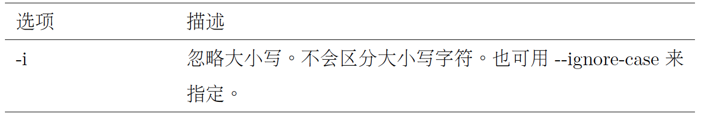
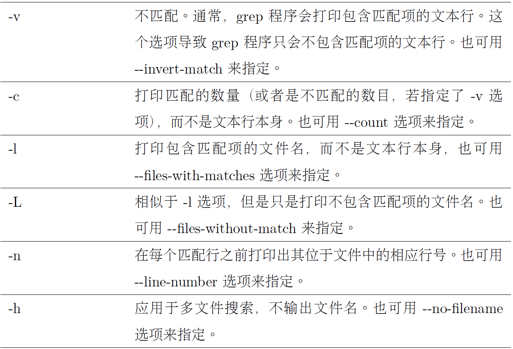
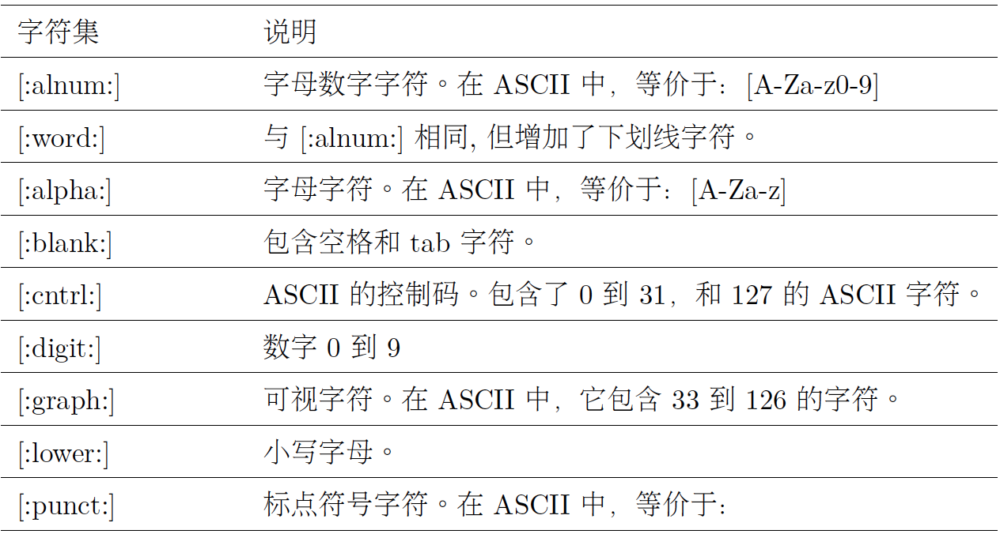
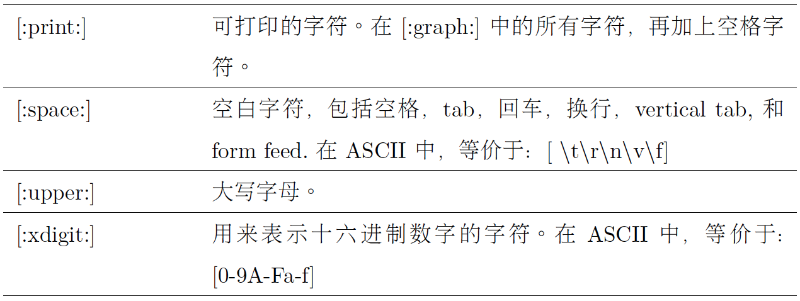
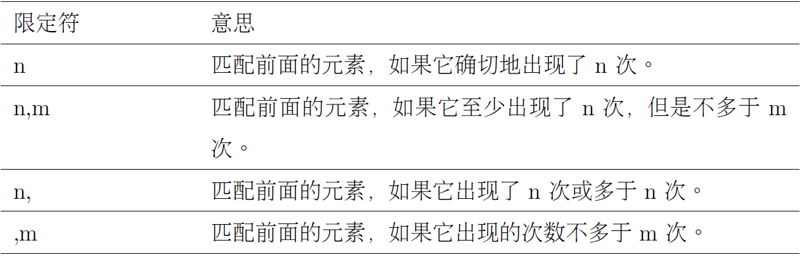

# Chap 19 Regular Expresion 

### Several Common Commandline

* **grep regex** : Match regular express pattern

* **?** : Match zero or one element. This quantifier means, in effect, “make the preceding element optional

* **\*** : Match zero or more element.

* **+** : Match one or more element.

* **{}** : Match minimum and maximum numbers of required
matches.


### Examples of Commandlines

* **grep regex** : grep [options] regex [file...] 





```
[me@linuxbox ~]$ ls /bin > dirlist-bin.txt
[me@linuxbox ~]$ ls /usr/bin > dirlist-usr-bin.txt
[me@linuxbox ~]$ ls /sbin > dirlist-sbin.txt
[me@linuxbox ~]$ ls /usr/sbin > dirlist-usr-sbin.txt
[me@linuxbox ~]$ ls dirlist*.txt
dirlist-bin.txt dirlist-sbin.txt dirlist-usr-sbin.txt dirlist-usr-bin.txt
[me@linuxbox ~]$ grep bzip dirlist*.txt
dirlist-bin.txt:bzip2
dirlist-bin.txt:bzip2recover
```

* "-l" match pattern, "-L" does not match pattern

```
[me@linuxbox ~]$ grep -l bzip dirlist*.txt 
dirlist-bin.txt
[me@linuxbox ~]$ grep -L bzip dirlist*.txt
dirlist-sbin.txt
dirlist-usr-bin.txt
dirlist-usr-sbin.txt
```

* **.** : used to match any character(equal or more than 1), so zip is not included in below match

```
[me@linuxbox ~]$ grep -h '.zip' dirlist*.txt
bunzip2
bzip2
abc.zip
```

* **^,$** : Cause the match to occur only if the regular expression is found at the beginning of the line or at the end of the line

```
[me@linuxbox ~]$ grep -h '^zip' dirlist*.txt
zip
zipcloak
zipgrep
zipinfo
zipnote
zipsplit
[me@linuxbox ~]$ grep -h 'zip$' dirlist*.txt
gunzip
gzip
funzip
gpg-zip
preunzip
prezip
unzip
zip
[me@linuxbox ~]$ grep -h '^zip$' dirlist*.txt
zip
```

* **Combination of '. ^ $'** :

```
[me@linuxbox ~]$ grep -i '^..j.r$' /usr/share/dict/words
Major
major
```

**[^]** : If the first character in a bracket expression is a caret (ˆ), the remaining characters are taken to be a set of characters that must not be present at the given character position. 

**Notice that the 'file' zip was not found. A negated character
set still requires a character at the given position, but the character must not be a member of
the negated set.**

```
[me@linuxbox ~]$ grep -h '[^bg]zip' dirlist*.txt
bunzip2
gunzip
funzip
gpg-zip
preunzip
prezip
```

```
[me@linuxbox ~]$ grep -h '^[A-Za-z0-9]' dirlist*.txt
```

* **$LANG** : see the language setting of our system

```
jiazhen@ubuntu:~/Downloads$ echo $LANG
en_US.UTF-8
```






* **( ) { } ? + |** : Extended regex, can use **grep -E**

```
[me@linuxbox ~]$ echo "AAA" | grep -E 'AAA|BBB'
AAA
[me@linuxbox ~]$ echo "BBB" | grep -E 'AAA|BBB'
BBB
```

* **PS** : To combine alternation with other regular expression elements, we can use () to separate the alternation

```
[me@linuxbox ~]$ grep -Eh '^(bz|gz|zip)' dirlist*.txt
[me@linuxbox ~]$ grep -Eh '^bz|gz|zip' dirlist*.txt
```

```
[me@linuxbox ~]$ echo "(555) 123-4567" | grep -E '^\(?[0-9][0-9][0-9]
\)? [0-9][0-9][0-9]$'
(555) 123-4567
[me@linuxbox ~]$ echo "555 123-4567" | grep -E '^\(?[0-9][0-9][0-9]\)
? [0-9][0-9][0-9]-[0-9][0-9][0-9][0-9]$'
555 123-4567
```

* **+** : combination of + ? ^ $

```
jiazhen@ubuntu:~/Downloads$ echo "abc d" | grep -E '^([[:alpha:]]+ ?)+$'
abc d
```

* **{}** :

```
^\(?[0-9][0-9][0-9]\)? [0-9][0-9][0-9]-[0-9][0-9][0-9][0-9]$
eual to 
^\(?[0-9]{3}\)? [0-9]{3}-[0-9]{4}$

```



* Use regex to find irregular character in file name

```
[me@linuxbox ~]$ find . -regex '.*[^-\_./0-9a-zA-Z].*'
[me@linuxbox ~]$ locate --regex 'bin/(bz|gz|zip)'
/bin/bzcat
/bin/bzcmp
/bin/bzdiff
```
