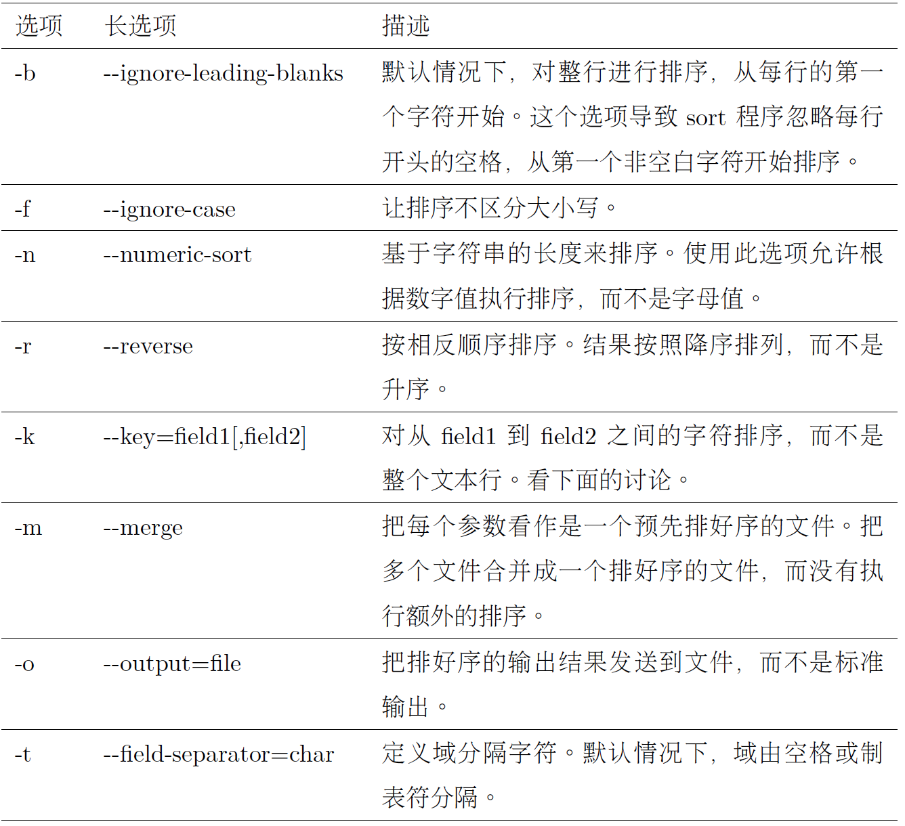
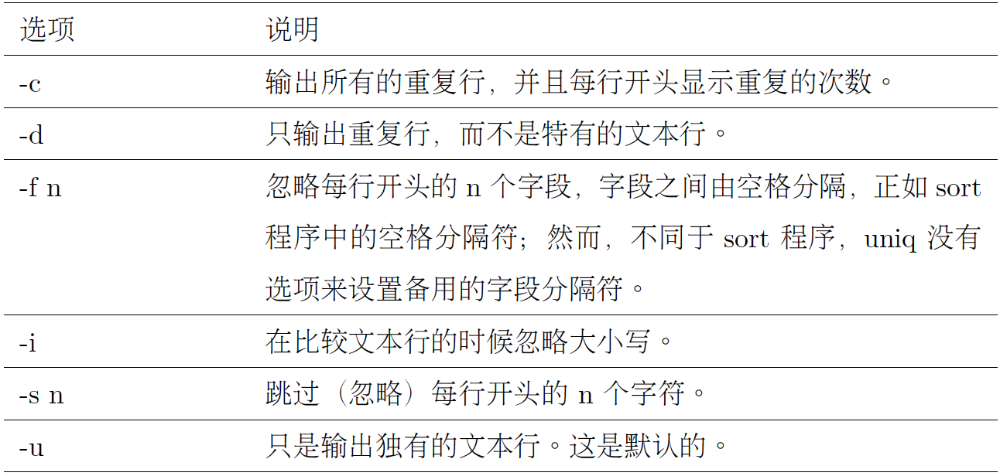

# Chap 20 Text Handling 

### Several Common Commandline

* **cut** : Remove sections from each line of files

* **uniq** : For uniq to actually do its job, the input must be sorted first

* **paste** : Merge lines of files.

* **join** : Join lines of two files on a common field

* **comm** : Compare two sorted files line by line

* **diff** : Compare files line by line

* **patch** : Apply a diff file to an original

* **tr** : Translate or delete characters

* **sed** : Stream editor for filtering and transforming text

* **aspell** : Interactive spell checker


### Examples of Commandlines

* **cat -A** : used to display nonprinting
characters in the text. 

* ^I means 'Tab'.

```
[me@linuxbox ~]$ cat -A foo.txt
^IThe quick brown fox jumped over the lazy dog.    $
[me@linuxbox ~]$
```

* **cat -ns** : -n, which numbers lines, and -s, which suppresses the output of multiple blank lines

```
[me@linuxbox ~]$ cat -ns foo.txt
1 The quick brown fox
2
3 jumped over the lazy dog.
[me@linuxbox ~]$
```

* **sort** : sort can accept multiple files on the command line as arguments

```
sort file1.txt file2.txt file3.txt > final_sorted_list.txt
```



* **sort -M** : sort month

```
$ sort -M > sort.txt
DEC
JAN
FEB
$ cat sort.txt 
JAN
FEB
DEC
```

* Example 1: sort by year, then month, then day, '-b' is necessary to exclude extra space.

```
jim@pluto # cat 1 | sort -b -k 4.7,4.8 -k 4.1,4.2 -k 4.4,4.5
988 7 Wri  02/09/11  06:45
988 5 Wri  09/23/11  06:45
49  3 Wri  07/25/12  20:01
49  6 Wri  07/30/12  20:01
988 8 Wri  08/09/12  06:45
988 1 Act  10/29/12  03:51
0   2 Que  12/08/12  16:51
```

* Example 2: first sort by first column by alpha, then sort by second column by number. 1,1 means “start at field one and end at field one.”

```
jiazhen@ubuntu:~/Downloads$ cat test1 
Alex,  15
Mary,  12
Alex,  28
Zoe,   16
Alex,  17
jiazhen@ubuntu:~/Downloads$ sort -b -k1,1 -k2nr test1 
Alex,  28
Alex,  17
Alex,  15
Mary,  12
Zoe,   16
```
* Example 3: sort by year, then month, then day

```
[me@linuxbox ~]$ sort -k 3.7nbr -k 3.1nbr -k 3.4nbr distros.txt
Fedora 10 11/25/2008
Ubuntu 8.10 10/30/2008
SUSE 11.0 06/19/2008
```

* **uniq** : For uniq to actually do its job, the input must be sorted first



```
[me@linuxbox ~]$ sort foo.txt | uniq -c
2 a
2 b
2 c
```

* **^,$** : Cause the match to occur only if the regular expression is found at the beginning of the line or at the end of the line

```
[me@linuxbox ~]$ grep -h '^zip' dirlist*.txt
zip
zipcloak
zipgrep
zipinfo
zipnote
zipsplit
[me@linuxbox ~]$ grep -h 'zip$' dirlist*.txt
gunzip
gzip
funzip
gpg-zip
preunzip
prezip
unzip
zip
[me@linuxbox ~]$ grep -h '^zip$' dirlist*.txt
zip
```

* **Combination of '. ^ $'** :

```
[me@linuxbox ~]$ grep -i '^..j.r$' /usr/share/dict/words
Major
major
```

**[^]** : If the first character in a bracket expression is a caret (ˆ), the remaining characters are taken to be a set of characters that must not be present at the given character position. 

**Notice that the 'file' zip was not found. A negated character
set still requires a character at the given position, but the character must not be a member of
the negated set.**

```
[me@linuxbox ~]$ grep -h '[^bg]zip' dirlist*.txt
bunzip2
gunzip
funzip
gpg-zip
preunzip
prezip
```

```
[me@linuxbox ~]$ grep -h '^[A-Za-z0-9]' dirlist*.txt
```

* **$LANG** : see the language setting of our system

```
jiazhen@ubuntu:~/Downloads$ echo $LANG
en_US.UTF-8
```


* **( ) { } ? + |** : Extended regex, can use **grep -E**

```
[me@linuxbox ~]$ echo "AAA" | grep -E 'AAA|BBB'
AAA
[me@linuxbox ~]$ echo "BBB" | grep -E 'AAA|BBB'
BBB
```

* **PS** : To combine alternation with other regular expression elements, we can use () to separate the alternation

```
[me@linuxbox ~]$ grep -Eh '^(bz|gz|zip)' dirlist*.txt
[me@linuxbox ~]$ grep -Eh '^bz|gz|zip' dirlist*.txt
```

```
[me@linuxbox ~]$ echo "(555) 123-4567" | grep -E '^\(?[0-9][0-9][0-9]
\)? [0-9][0-9][0-9]$'
(555) 123-4567
[me@linuxbox ~]$ echo "555 123-4567" | grep -E '^\(?[0-9][0-9][0-9]\)
? [0-9][0-9][0-9]-[0-9][0-9][0-9][0-9]$'
555 123-4567
```

* **+** : combination of + ? ^ $

```
jiazhen@ubuntu:~/Downloads$ echo "abc d" | grep -E '^([[:alpha:]]+ ?)+$'
abc d
```

* **{}** :

```
^\(?[0-9][0-9][0-9]\)? [0-9][0-9][0-9]-[0-9][0-9][0-9][0-9]$
eual to 
^\(?[0-9]{3}\)? [0-9]{3}-[0-9]{4}$

```


* Use regex to find irregular character in file name

```
[me@linuxbox ~]$ find . -regex '.*[^-\_./0-9a-zA-Z].*'
[me@linuxbox ~]$ locate --regex 'bin/(bz|gz|zip)'
/bin/bzcat
/bin/bzcmp
/bin/bzdiff
```
